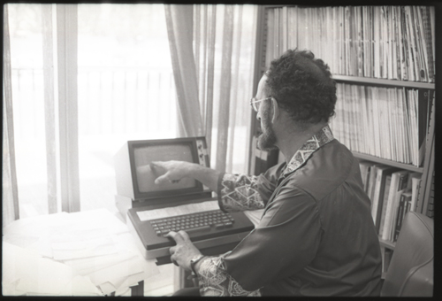

# finger2020

*A tiny, secure [finger](https://en.wikipedia.org/wiki/Finger_protocol) daemon for single-user unix systems.*



*Les Earnest, the creator of the original finger program, at SAIL circa 1976 [(source)](https://www.saildart.org/Visitor_1976/).*

## About

This finger service uses files to load contact information, and will not extract
any sensitive information directly from the host system. So relax! Only one user
profile is supported (hence, "single-user"). It's intended to be used by a sysop
to broadcast server news and/or personal contact information over the internet.

## Operation

This program is designed to be hosted behind a systemd socket or a comparable
``inetd``-like service. The program will read a one-line query from stdin. The
response string will be written to stdout, and all error/logging messages will
be directed to stderr and should be setup to route to an appropriate system log
manager.

## Query Support

Only the user list and user status queries are supported. Queries with
ambiguous user names will be rejected. Queries with hostnames will be rejected.
The verbose flag (``/W``) is accepted but will be ignored.

## Usage

```bash
# Query user list
echo -e "\r\n" | finger2020

# Query user information
echo -e "username\r\n" | finger2020
```

## Configuration

Settings are defined through environment variables.

#### ``FINGER_NAME``

A string that will represent the user's finger name. This can be any
arbitrary value and does not need to correspond to a real user on the
system.

#### ``FINGER_CONTACT``

This file replaces the section of the query response that contains
information that finger would typically pull from */etc/passwd* and the GECOS
field. Common values to include in this section include login name, real name,
phone number, office, address, and recent system activity.

#### ``FINGER_PROJECT``

This file typically contains a multi-line "profile page" with additional
information about the user. The information documented in this file does not
frequently change.

#### ``FINGER_PLAN``

This file typically contains a brief description of what the user is currently
working on. This file is intended to be updated frequently and there are no
restrictions on what type of information the user can include.

#### ``FINGER_INFO_LABELS``

Set to "true" or "false" to toggle showing the 'Project:' and 'Plan:' labels
in the response.

## Links

- [RFC 742 - NAME/FINGER](https://tools.ietf.org/html/rfc742)
- [RFC 1288 - The Finger User Information Protocol](https://tools.ietf.org/html/rfc1288)
- [History of the Finger Protocol](http://www.rajivshah.com/Case_Studies/Finger/Finger.htm)
- [IETF Draft finger URL Specification](https://tools.ietf.org/html/draft-ietf-uri-url-finger-02)
- [Info-Gathering Tutorial](http://cd.textfiles.com/hmatrix/Tutorials/hTut_0173.html)
- [Giving the Finger to port 79 / Simple Finger Deamon Tutorial](http://cd.textfiles.com/hmatrix/Tutorials/hTut_0269.html)
